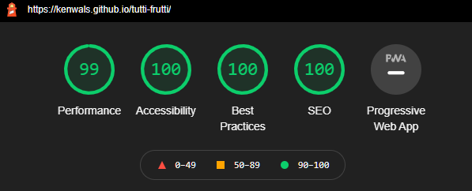

# Tutti Frutti


This is a colourful and interactive memory card game featuring fruit emojis

:lemon: :cherries: :pear: :orange: :peach: :strawberry: :apple: :banana:

---

## Table of contents

- [UX](#ux)
  - [Scope](#scope)
    - [User stories](#user-stories)
  - [Structure](#structure)
  - [Skeleton](#skeleton)
  - [Surface](#surface)
    - [Colours](#colours)
    - [Icons](#icons)
    - [Images](#images)
    - [Fonts](#fonts)
- [Features](#features)
- [Technologies Used](#technologies-used)
- [Testing](#testing)
  - [Performance Testing](#performance-testing)
  - [Known issues](#known-issues)
  - [Project barriers and solutions](#project-barriers-and-solutions)
  - [Version control](#version-control)
  - [Functionality Testing](#functionality-testing)
  - [CSS3 validator](#css3-validator)
  - [HTML5 validator](#html5-validator)
  - [Usability Testing](#usability-testing)
  - [Compatibility Testing](#compatibility-testing)
  - [Testing User Stories](#testing-user-stories)
- [Deployment](#deployment)
- [Credits](#credits)
  - [Content](#content)
  - [Resources](#resources)
  - [Media](#media)
  - [Acknowledgements](#acknowledgements)

---

## UX

### Scope

The site is three pages, it contains a menu page , a game page and an info page.  Its targeted at users of all ages and types.

#### User stories

##### Visitor goals

  1. As a visitor to this game site , I want to be able to play a fun game and test my memory.
  2. As a visitor to this game site , I want the ability to change the colour theme of the game so it doesn't strain my eyes.
  3. As a visitor to this game site , I want the ability to select a difficulty level that suits me best .
  4. As a visitor to this game site , I want to be able to submit my high score to the leaderboard.

##### Owner goals

  1. As the site owner, I want to be able to play a fun game and test my memory.

### Structure

This site will be put together with HTML, using the bootstrap framework along with CSS. The game, Interactive elements and leaderboard are done using JavaScript and jQuery . The Leaderboard is connected to a Firebase realtime Database.

### Skeleton

The site appears as three pages to the user, technically it's really one page with three sections that collapse away when not needed using bootstraps collapse component.

Page 1 - Homepage or Main Menu - Game title, Theme and Difficulty settings , Start button.

Page 2 - Game page - Card game page with timer, score ,flips gauge and modals.

Page 3 - How to play / Top Scores - Top scores on are display here .There some info on how to play the game and on how the score is calculated.

8 card pairs - Fruit emojis used  are :lemon: :cherries: :pear: :orange: :peach: :strawberry: :apple: :banana:

Wireframe


### Surface

#### Colours

Colours are vibrant and fun by default . Three colour theme options.

1. Colourful theme (default). The backgound is a css gradient image done with a combination the colours used on the fuit emojis.

  #F82131, #CFDE0A, #FC8440, #FF9300, #449C00
  
2. Light theme - Light background , Dark text
3. Dark theme - Dark background, Light text

#### Icons

Font awesome is used for icons.

#### Images

Graphics (cards , logo and favicon ) used are created by [Rudy de Souza](https://rudydesouza.com/), emojis used are from joypixels.com

#### Fonts

- **"Jockey One"** was used for Header (h1,h2 and h3) text elements
- **"VT323"** was used for all other text.

On slow connections, another font may be visible while the site is loading.

back to [contents](#table-of-contents)

---

## Features

- There are three difficulty levels
- There are three theme options
- The game stores your current highest score (Personal Best) in your browser, when you beat that score you can submit your new score to the leaderboard.
- There is top 10 leaderboard of highest scores by all users. This uses the Firebase Realtime Database API , player names and scores are saved in this NoSQL database, scoreboard is updated on the site in realtime.
- Local Storage API is used for storing and remembering the preferred difficulty level and theme setting when the user returns to the game.

## Technologies Used

- Languages : HTML, CSS , Bootstrap framework, JavaScript , and JQuery
- Realtime Database: [Firebase](https://firebase.google.com/)
- IDE: Visual Studio Code (VS Code).
- Version control: Git on VS Code terminal , [Github](https://github.com/) Desktop app and at repository web page.
- Wireframe: [Balsamiq](https://balsamiq.com/)
- Browser Developer tools : [Google Chrome](https://www.google.com/chrome) for console.logging everything.
- Kanban planner : [Github projects](https://github.com/kenwals/tutti-frutti/projects/1).
- Markdown editor: [Typora](https://typora.io/) was used when doing spellchecks and big changes to my README.md file, VS code editor was used for minor updates.
- Fonts : [Google Fonts](https://fonts.google.com/)
- Icons : [Fontawesome](https://fontawesome.com/)
- File renaming utility : PowerRename from [PowerToys on Windows 10](https://www.windowscentral.com/how-bulk-rename-your-files-windows-10-powertoys)
- Pomodoro timer : [Tomato Clock](https://chrome.google.com/webstore/detail/tomato-clock/enemipdanmallpjakiehedcgjmibjihj)
- Overflow rescue tool : [Unicorn Revealer](https://chrome.google.com/webstore/detail/unicorn-revealer/lmlkphhdlngaicolpmaakfmhplagoaln) was used for when a scroll left to right appeared on my site on smaller screens.
- Colour contrast checking for Accessibility refinements : [WebAIM](https://webaim.org/resources/contrastchecker/) was used for when trying to decide what colours to use for text against which background colour.
- Favicon creator : [favicon.io](https://favicon.io/favicon-generator/)
- Autoprefixer CSS : [Autoprefixer](https://autoprefixer.github.io/)
- Auto formatter for HTML and CSS : [dirtyMarkUp](https://www.10bestdesign.com/dirtymarkup/) and  [webformatter](https://webformatter.com/html)
- JSlint
- markdown linter
- linters!

back to [contents](#table-of-contents)

---

## Testing

I tested the site as I went along, manually testing or using automated online testing tools (listed below). I focused on getting the site working on a small mobile phone screen first (iPhone 5 simulation on the Chrome Developer tools), and then subsequently all other screen sizes. In earlier versions of the code, the command console.log was used extensively to monitor if the JavaScript/JQuery was working correctly.

I used JQuery commands below in developer tools console to give myself some shortcuts while testing the game.

```javascript
$(".card").addClass("visible")  // this turns over all the playing cards
$("#modal-you-win-leaderboard").modal("show") // this triggers a high score modal to pop up
$("#modal-you-win-leaderboard").modal("hide")  // this hides the you win leaderboard modal 
localStorage.clear() // this clears the local storage completely
localStorage.setItem("topScore" , 0) // this resets your topScore to zero
```

### Performance Testing



### Known issues

On local desktop, the dropdown menu button can become unresponsive. This bug could be limited to the Python http server when running a long time . I have not seen this happen on the deployed version.

In the firefox browers some errors appear in the developer tool console in relation to mime / javascript.

Edge case - back button is pressed and timer runs out.

DRY code conflict controversy !

### Project barriers and solutions

modal setup mistake with ids

Firebase orderByChild not working as expected

passing scores as strings

JavaScript syntax differances p5 JS verses node JS verses vanilla

Peer review feedback

### Version control

For version control I used the UI on VS Code for making commits, and command line for branches, Merging was done on the GitHub site. I used branches when I was working on new features or bundles of changes.

### Functionality Testing

### CSS3 validator

no errors

### HTML5 validator

no errors

### Usability Testing

### Compatibility Testing

### Testing User Stories

back to [contents](#table-of-contents)

---

## Deployment

For easy deployment on GitHub pages you will need a GitHub user account and a possibly a Gitpod user account. If you wish to make changes to this repository, please follow the GitHub steps first.

### GitHub

GitHub is a code hosting platform for version control and collaboration. It's free to enrol for a user account and I would recommend you have one if you wish to deploy this repository and make changes.

When you have a GitHub account you can simple click on the Fork button on the top right corner. This is clone the Tutti-Frutti repository for your GitHub account, then you can make any changes you like.

### Gitpod

The site can be edited easily on a Gitpod online workspace, you first register a free user account on <http://gitpod.io/>, then download the Gitpod extension on your preferred internet browser. On signing up you will be expected to  have a GitHub user account.

Once you have the extension on your browser, a green Gitpod button will appear beside this repository in GitHub. For best results fork the repository in your personal account before you open it in Gitpod.

### GitHub Pages

Once you have the completed site in your own repository, you can deploy to GitHub pages by the following steps.

1. On GitHub, go to the completed sites repository.
2. Click on settings, on the settings page scroll down the the GitHub Pages section.
3. Under GitHub pages, Select the appropriate branch or folder the index.html is in.
4. Click on save. A message should then appear advising the URL of your deployed site.

### Cloning

If you prefer working on the repository locally, you can clone the repository to your desktop by the following steps.

1. Go to [the Tutti Frutti github page](https://github.com/kenwals/tutti-frutti).
2. Above the list of files, click on the code button.
3. To clone the repository using HTTPS, under "Clone with HTTPS", click the paste icon.
   To clone the repository using an SSH key, click Use SSH, then click the paste icon.
   To clone a repository using GitHub CLI, click Use GitHub CLI, then click the paste icon.
4. Open Git Bash.
5. Change the current working directory to the location where you want the cloned directory.
6. Type 'git clone', then paste the URL you copied earlier above.
7. Press Enter to create your local clone.

more detailed instructions available [here](https://docs.github.com/en/free-pro-team@latest/github/creating-cloning-and-archiving-repositories/cloning-a-repository)

### Forking

You may wish to contribute to this website and have your contribution published, if so, you are welcome to follow these steps below.

1. Go to the GitHub website and log in.
2. Open <https://github.com/kenwals/tutti-frutti>
3. In the top right-hand corner you will see a fork button, click on this fork button .
4. This will create a copy the Tutti-Frutti repository in your github account.
5. Once you're finished making changes you can locate the 'New Pull Request' button just above the file listing in the original repository(<https://github.com/kenwals/tutti-frutti>).
6. If your pull request is approved, it will be merged into the master version of the Tutti-Frutti repository at a future date.

more detailed instructions available [here](https://docs.github.com/en/free-pro-team@latest/github/getting-started-with-github/fork-a-repo)

back to [contents](#table-of-contents)

---

## Credits

### Content

Some of the customised code used for the card game in script.js and style.css is derived from a two part YouTube video called "How to Code a Card Matching Game" published by [Web Dev Simplified](https://youtu.be/28VfzEiJgy4)  & [PortEXE](https://youtu.be/3uuQ3g92oPQ) . Click on the links for the videos.

Graphics used are created by Artist and Graphic Designer [Rudy de Souza](https://rudydesouza.com/)

### Resources

Local storage API handling was influenced by [this page on MDN](https://developer.mozilla.org/en-US/docs/Web/API/Web_Storage_API/Using_the_Web_Storage_API)

Firebase realtime database code used for the Leaderboard.js script was based on (and later customised)code used in the following YouTube videos

- [16.9: Array Functions: sort() - Topics of JavaScript/ES6](https://youtu.be/MWD-iKzR2c8)  (Channel : The coding Train)

- [9.3: Firebase: Retrieving Data - Programming with Text](https://youtu.be/NcewaPfFR6Y)    (Channel : The coding Train)

- [9.2: Firebase: Saving Data - Programming with Text](https://youtu.be/7lEU1UEw3YI)    (Channel : The coding Train)

- [Firebase Database Querying 101 - The Firebase Database For SQL Developers #3](https://youtu.be/3WTQZV5-roY)  (Channel : FIREBASE )

- [Common SQL Queries converted for the Firebase Database - The Firebase Database For SQL Developers #4](https://youtu.be/sKFLI5FOOHs)  (Channel : FIREBASE )
- [Connecting Firebase to a Contact Form](https://youtu.be/PP4Tr0l08NE) (Channel : Traversy Media)

### Media

Emojis used on playing cards are from [Joypixels](https://www.joypixels.com/emoji)

### Acknowledgements

Game layout/structure is inspired by [PROXX](https://www.proxx.app/) , more interesting background [info here.](https://web.dev/proxx-announce/)

My mentor Maranatha Ilesanmi.

Various people at the [code institute](https://codeinstitute.net/) and on the code institute Slack channel.
